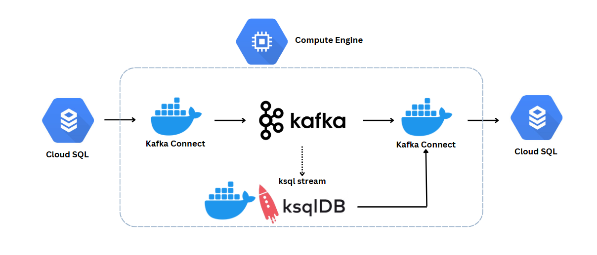

# Change Data Capture with Kafka

**Description** :

A theater wants to create a data sync system between databases with Kafka that has CDC incoming processing to be able to capture the binlog of the source database and process it into the destination database correctly, completely, and immediately in real-time sync.

**Tools** :

**Data flow chart** :

**Getting Started** :

1. Example of first 5th row data in kafka-class-db-001 database.

| movie_id | title                    | release_year | country       | genres                    | actors                                                                                                                                                                           | directors                | composers                   | screenwriters                                                       | cinematographer    | production_companies                                    |
| -------- | ------------------------ | ------------ | ------------- | ------------------------- | -------------------------------------------------------------------------------------------------------------------------------------------------------------------------------- | ------------------------ | --------------------------- | ------------------------------------------------------------------- | ------------------ | ------------------------------------------------------- |
| 1        | The Master               | 1968         | Italy         | Western                   | Claudia Cardinale|Charles Bronson|Henry Fonda|Gabriele Ferzetti|Frank Wolff|Al Mulock|Jason Robards|Woody Strode|Jack Elam|Lionel Stander|Paolo Stoppa|Keenan Wynn|Aldo Sambrell | Sergio Leone             | Ennio Morricone             | Sergio Leone|Sergio Donati|Dario Argento|Bernardo Bertolucci        | Tonino Delli Colli | Paramount Pictures                                      |
| 2        | 10,000 B.C.              | 2008         | United States | Adventure                 | Steven Strait|Camilla Belle|Cliff Curtis|Omar Sharif|Tim Barlow|Marco Khan|Reece Ritchie|Mo Zinal                                                                                | Roland Emmerich          | Harald Kloser|Thomas Wanker | Roland Emmerich|Harald Kloser|John Orloff|Matthew Sand|Robert Rodat | Ueli Steiger       | Warner Bros. Pictures|Legendary Pictures|Centropolis    |
| 3        | It's Always Fair Weather | 1955         | United States | Musical|Comedy            | Gene Kelly|Cyd Charisse|Dan Dailey|Dolores Gray|Michael Kidd|David Burns|Jay C. Flippen|Hal March|Steve Mitchell                                                                 | Stanley Donen|Gene Kelly | Andre Previn                | Adolph Green|Betty Comden                                           | Robert Bronner     | Metro-Goldwyn-Mayer                                     |
| 4        | Tarzan                   | 1999         | United States | Animation|Adventure|Drama | Animation                                                                                                                                                                        | Kevin Lima|Chris Buck    | Mark Mancina                | Tab Murphy                                                          | Animation          | Walt Disney Pictures|Edgar Rice Burroughs Inc.          |
| 5        | Only You                 | 1994         | United States | Comedy|Romance            | Marisa Tomei|Robert Downey Jr.|Bonnie Hunt|Joaquim de Almeida|Fisher Stevens|Billy Zane|Adam LeFevre|John Benjamin Hickey|Siobhan Fallon                                         | Norman Jewison           | Rachel Portman              | Diane Drake                                                         | Sven Nykvist       | TriStar Pictures|Fried|Woods Films|Yorktown Productions |

2. Set up docker compose in compute engine.
3. Create and upload source connector "mysql-sorce.json".

4. Create and upload sink connector "mysql-sink-kafka". This step all data from "kafka-class-db-001" already sync to "kafka-class-db-002".

    >Check that it is already sync. By try to update movie name at kafka-class-db-001 by change "name" of movie_id = 1 to "The Master Edited" 
    
    
    > The movie name at "kafka-class-db-002" already change follow kafka-class-db-001

5. Use ksqlstream to create stream name "ksqlstream_processed". Select "movie_id", "title" and "num_year_release".
    
6. Create and upload sink connector "mysql-sink-ksql" to sync a query data to "kafka-class-db-002" database.
    
    
    
    >Check all of these databases already sync. By try to update movie name at kafka-class-db-001 by change "name" of movie_id = 4 to "Tarzan 2"

    
    

Conclusion : Data already synced together. When data in kafka-class-db-001 was changed, It will sync to the movies table and movies_title table in kafka-class-db-002 too.

Thank you reference data from : https://school.datath.com/